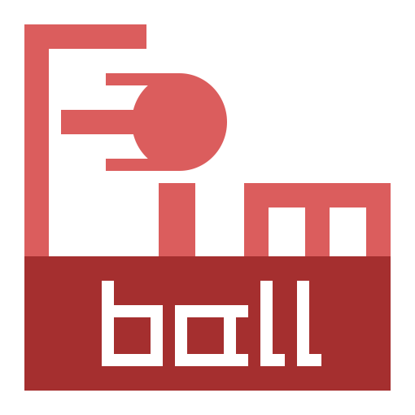
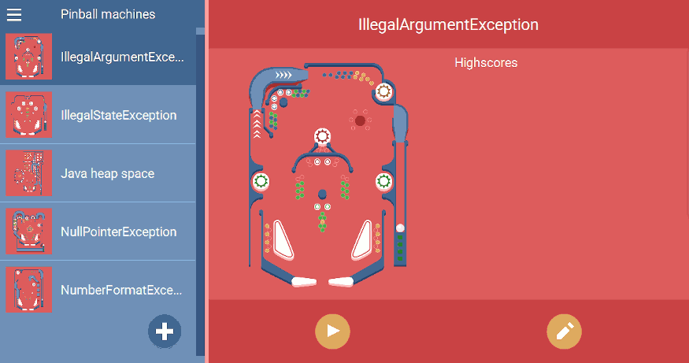

# Fimball
A pinball game incl. editor written in JavaFX.

The game was created for the bachelor Course "SEP - Software Engineering Project" at the University of Passau.

## How to play
The game can be played by [downloading](https://next.dascloud.de/index.php/s/RxtPJTk6YegKwPb) a release, unzipping it and starting it via a run file.

## Features

### 🕹 Playing 
* Unlimited player count
* Camera follows the ball
* Free playing 😉

### 🛠 Editor
* Create your own pinball machine
* Unlimited machine size
* Double layered
* 53 different machine elements
* Basic editor functions
  * Select
  * Copy
  * Paste
  * Delete
* Extented editor functions:
  * Multiselect
  * Drag and drop
  * Rotate

### ⚗ Mod support
One can add new machine elements by adding new element definitions to `data/elements`.

## Built With
* [Java](https://openjdk.java.net/) - Programming language
* [JavaFX](https://wiki.openjdk.java.net/display/OpenJFX/Main) - GUI Framework
* [JavaFxSVG](https://github.com/codecentric/javafxsvg) - Library to add SVG support to JavaFX
* [JUnit](https://junit.org/) - Testing Framework
* [Apache Maven](https://maven.apache.org/) - Dependency Management

## Authors
* **Till Wübbers** - *Initial work* - [tillwuebbers](https://github.com/tillwuebbers)
* **Kai Rädsch** - *Initial work* - [kairaedsch](https://github.com/kairaedsch)
* Three others - *Initial work*

## License
This project is licensed under the GNU General Public License - see the [LICENSE.md](LICENSE.md) file for details
